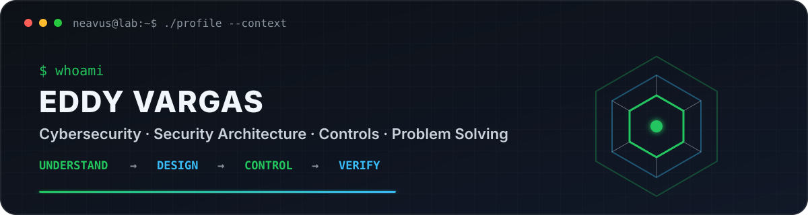
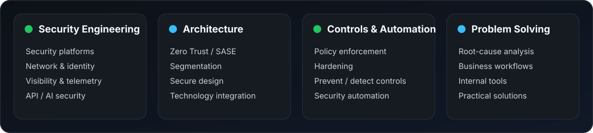

<div align="center">

<picture>
  <source media="(prefers-color-scheme: dark)" srcset="assets/banner-dark.v3.svg">
  <source media="(prefers-color-scheme: light)" srcset="assets/banner-light.v3.svg">
  
</picture>

<br>

<a href="https://github.com/neavus-23">
  
</a>

<br>


</div>

---

## `whoami`

I'm **Eddy Vargas**, a cybersecurity professional from Costa Rica who enjoys understanding complex systems, finding where they can fail, and turning that context into practical security decisions.

My work and interests sit around **security engineering**, **architecture**, **network security**, **identity**, **controls**, **automation**, **APIs** and **problem solving**.

I'm **not a software developer by trade**. I use code when it helps solve the problem better — whether that's automating a security check, correlating data from several platforms, building an internal tool or improving a business workflow.

I also explore AI security, application security and emerging technologies when they intersect with real security problems rather than because they're fashionable.

> I like systems with logs. Memory is unreliable; evidence has better uptime.

---

<div align="center">

## `what_i_do`

<picture>
  <source media="(prefers-color-scheme: dark)" srcset="assets/focus-dark.v3.svg">
  <source media="(prefers-color-scheme: light)" srcset="assets/focus-light.v3.svg">
  
</picture>

</div>

---

## `projects_and_experiments`

### 🛡️ Marvaris Guardian

**AI Runtime Security & Governance Platform**

A security control plane and runtime gateway for applications consuming LLMs, AI agents and MCP. It explores policy enforcement, runtime protection, evidence, asset visibility and governance as engineering problems rather than checkbox features.

`Runtime Protection` · `Policy Enforcement` · `AI Asset Graph` · `MCP Governance` · `Risk` · `Evidence & Audit`

> Private project. AI Security is one area I explore — not the entirety of what I do.

### ◈ CyberHub

**Enterprise Security Visibility & Control Platform**

A modular security operations solution designed to correlate information from different security platforms, automate repetitive checks and turn scattered operational data into useful security context.

`Cisco ASA / FTD` · `Sophos Central` · `CyberArk` · `Active Directory` · `SEPM`

### ⚔️ Souls Dev Skill

An experimental workflow for disciplined, evidence-driven technical work built around one rule: **never trust a successful implementation until you've tried to prove it wrong**.

[View repository →](https://github.com/neavus-23/souls-dev-skill)

---

## `business_side_quests`

I also enjoy solving non-security problems for businesses.

Sometimes the right answer is a process change. Sometimes it's automation. Sometimes it's a small system that prevents another spreadsheet from evolving into critical infrastructure.

Some private projects include:

- **Flashé Loyalty** — loyalty and customer-retention solution.
- **Flashé Manager** — internal operations and customer-management tooling.
- **Automation utilities** — small tools for removing repetitive work before repetition becomes an incident of its own.

My usual approach is simple: **understand the problem first, then choose the smallest solution that actually fixes it.**

---

<div align="center">

## `toolbox`


<br><br>


</div>

---

<div align="center">

## `credentials`

**CompTIA Security+** · **CompTIA CySA+** · **CCSK** · **Microsoft AZ-700** · **eJPT**

<br>

`Security Engineering` · `Architecture` · `Network Security` · `Controls` · `Automation` · `AI Security`

</div>

---

## `how_i_think`

```text
understand  → know what actually exists
observe     → collect evidence, not assumptions
design      → choose controls that fit the problem
implement   → make the decision real
automate    → stop solving the same problem manually
verify      → because "it should work" is not a test
```

> "Trust me" is not a security control.

---

## `side_quests`

When I'm not working on security problems, there's a good chance I'm somewhere around:

`Gaming` · `CTFs & hacking labs` · `PC hardware` · `FPV drones` · `Photography / video` · `Projects that started with "this should take an hour"`

I enjoy hacking and CTFs as a way to understand systems from another angle — curiosity first, job title second.

And games? Mostly the same pattern: **learn the rules, understand the system, find the edge cases, defeat the boss.**

---

<div align="center">

## `currently_exploring`

Security Architecture · Security Engineering · Zero Trust · Network Security · API Security  
Security Automation · AI / Agent Security · MCP · Business Solutions · Whatever problem looks interesting next

<br><br>

<sub>understand the system · design the control · solve the problem · verify the result</sub>

<br>

<sub>github.com/neavus-23</sub>

</div>
