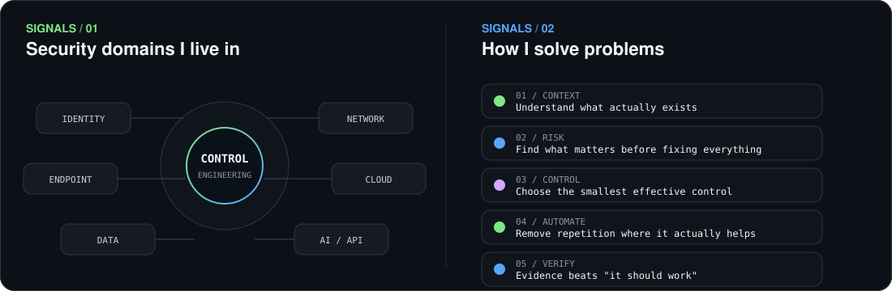
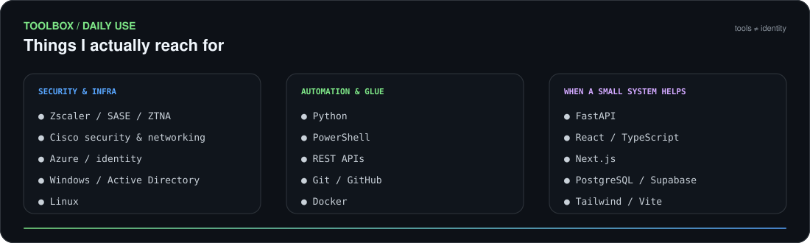

 

 

---

## This is me :)

I'm **Eddy Vargas**, a cybersecurity professional from Costa Rica. I like understanding complex systems, figuring out where risk actually lives, and turning that context into controls that make sense outside a PowerPoint.

- 🛡️ Most of my work sits around **security engineering, architecture, network security, identity, controls and automation**.
- 🔧 I'm **not a software developer by trade**. I use code, APIs and small systems when they're the shortest useful path to solving a problem.
- 🧠 I explore **AI security, application security and emerging technologies** when they intersect with real security problems.
- 🎮 Outside work: **gaming, CTFs and hacking labs, PC hardware, FPV drones, photography/video** and projects that usually begin with *"this should take an hour."*

> I prefer controls that fail loudly and logs that survive the incident.

---

---

  

Also experimenting with <a href="https://github.com/neavus-23/souls-dev-skill">Souls Dev Skill</a> — evidence-driven technical work with a healthy distrust of implementations that pass on the first try.

---

 

Tools are means, not identities. Pick what solves the problem without creating three new ones.

---

---

When security isn't consuming the available RAM:

`Gaming` · `CTFs & hacking labs` · `PC hardware` · `FPV drones` · `Photography / video` · `Business ideas` · `Random technical rabbit holes`

I enjoy hacking and CTFs as a way to understand systems from another angle — curiosity first, job title second. Games scratch roughly the same itch: **learn the rules, understand the system, find the edge cases, defeat the boss.**

---

` understand the system · design the control · solve the problem · verify the result `

  

github.com/neavus-23

