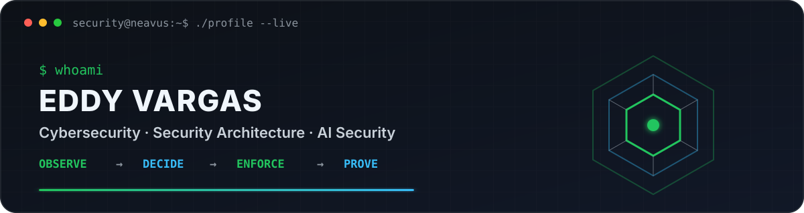
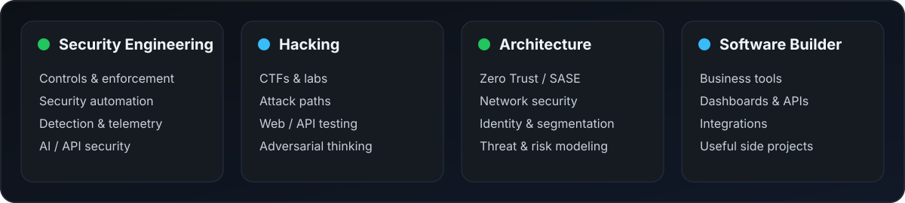

<div align="center">

<picture>
  <source media="(prefers-color-scheme: dark)" srcset="assets/banner-dark.svg">
  <source media="(prefers-color-scheme: light)" srcset="assets/banner-light.svg">
  
</picture>

<br>

<a href="https://github.com/neavus-23">
  
</a>

<br>


</div>

---

## `whoami`

I'm **Eddy Vargas**, a cybersecurity professional from Costa Rica who likes understanding how systems work, how they fail, and how to make them harder to abuse.

Most of my work lives somewhere between **security engineering**, **architecture**, **network security**, **hacking**, **automation**, **controls**, and **software development**.

I also build software for businesses simply because I enjoy taking a messy process and turning it into something useful.

AI security is one of the areas I explore — alongside offensive security, Zero Trust, APIs, infrastructure, identity and whatever rabbit hole looks interesting enough that week.

> I like systems with logs. Postmortems are easier when the corpse leaves evidence.

---

<div align="center">

## `what_i_build_and_break`

<picture>
  <source media="(prefers-color-scheme: dark)" srcset="assets/security-focus-dark.svg">
  <source media="(prefers-color-scheme: light)" srcset="assets/security-focus-light.svg">
  
</picture>

</div>

---

## `featured_builds`

### 🛡️ Marvaris Guardian

**AI Runtime Security & Governance Platform**

A security control plane and runtime gateway for applications consuming LLMs, AI agents and MCP. It explores runtime protection, policy enforcement, evidence, asset visibility and governance as engineering problems rather than checkbox features.

`Runtime Protection` · `Policy Enforcement` · `AI Asset Graph` · `MCP Governance` · `Risk` · `Evidence & Audit`

**Stack:** `Python` · `FastAPI` · `PostgreSQL + pgvector` · `Redis` · `Next.js` · `React` · `Keycloak` · `OpenTelemetry`

> Private development project. Public technical material and sanitized case studies will be published progressively.

### ◈ CyberHub

**Enterprise Security Visibility & Control Platform**

A modular security operations portal designed to correlate information from multiple security platforms, automate repetitive checks and turn scattered operational data into useful security context.

`Cisco ASA / FTD` · `Sophos Central` · `CyberArk` · `Active Directory` · `SEPM`

**Stack:** `Python` · `FastAPI` · `React` · `TypeScript` · `SQLAlchemy` · `Windows Services`

> Private development project.

### ⚔️ Souls Dev Skill

An experimental development workflow centered on deliberate engineering, adversarial review and one simple rule: **never trust a successful implementation until you've tried to kill it yourself**.

[View repository →](https://github.com/neavus-23/souls-dev-skill)

---

## `business_side_quests`

Security is the day job. Building things is the hobby that got out of control.

I enjoy creating practical software for real-world operations: internal tools, dashboards, automation, customer experiences and small SaaS-style products.

Some current private builds include:

- **Flashé Loyalty** — digital loyalty and customer retention platform.
- **Flashé Manager** — internal operations / CRM tooling for a small business.
- **Automation tools** — scripts and utilities for removing repetitive work before it removes my will to live.

The goal is usually the same: **less manual work, fewer spreadsheets pretending to be databases, and software that solves an actual problem.**

---

<div align="center">

## `toolbox`


<br><br>


</div>

---

<div align="center">

## `credentials`

**CompTIA Security+** · **CompTIA CySA+** · **CCSK** · **Microsoft AZ-700** · **eJPT**

<br>

`Security Engineering` · `Architecture` · `Offensive Security` · `AI Security` · `Automation`

</div>

---

## `how_i_think_about_security`

```text
understand  → know what actually exists
observe     → collect evidence, not assumptions
attack      → find out how it fails
control     → reduce what can go wrong
automate    → stop solving the same problem twice
verify      → because "it should work" is not a test
```

> "Trust me" is not a security control.

---

## `side_quests`

When I'm not building or breaking systems, there's a good chance I'm:

`Gaming` · `CTFs & hacking labs` · `PC hardware` · `FPV drones` · `Photography / video` · `Building unnecessary projects because I had an idea at 1 AM`

I like games for roughly the same reason I like security: **learn the rules, understand the system, find the edge cases, defeat the boss.**

---

<div align="center">

## `currently_exploring`

Security Architecture · Offensive Security · Attack Paths · API Security · Zero Trust  
Security Automation · AI / Agent Security · MCP · Business Software · Whatever breaks next

<br><br>

<sub>build things · break things · understand why they broke · build them better</sub>

<br>

<sub>github.com/neavus-23</sub>

</div>
