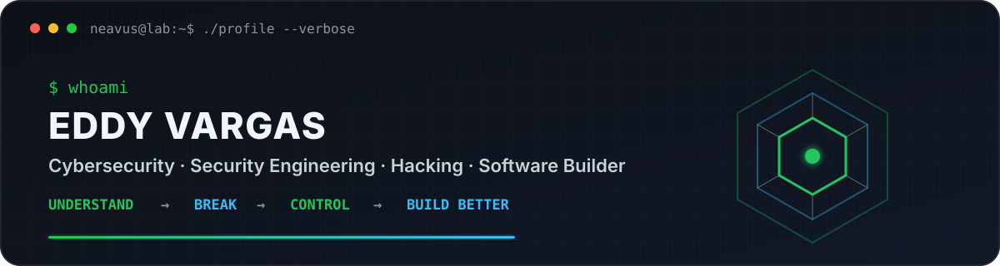
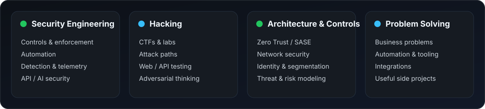

<div align="center">

<picture>
  <source media="(prefers-color-scheme: dark)" srcset="assets/banner-dark.v2.svg">
  <source media="(prefers-color-scheme: light)" srcset="assets/banner-light.v2.svg">
  
</picture>

<br>

<a href="https://github.com/neavus-23">
  
</a>

<br>


</div>

---

## `whoami`

I'm **Eddy Vargas**, a cybersecurity professional from Costa Rica who enjoys understanding how systems work, how they fail, and how to make them harder to abuse.

My work and interests sit somewhere between **security engineering**, **architecture**, **network security**, **hacking**, **controls**, **automation**, **APIs** and **problem solving**.

I'm **not a software developer by trade**. I use code when it is the shortest path from a problem to a useful solution — whether that means automating a security check, correlating data from several platforms, building an internal tool or solving a business problem.

AI security is one of the areas I explore, alongside offensive security, Zero Trust, infrastructure, identity, application security and whatever technical rabbit hole looks interesting enough that week.

> I like systems with logs. Postmortems are easier when the corpse leaves evidence.

---

<div align="center">

## `what_i_do`

<picture>
  <source media="(prefers-color-scheme: dark)" srcset="assets/focus-dark.v2.svg">
  <source media="(prefers-color-scheme: light)" srcset="assets/focus-light.v2.svg">
  
</picture>

</div>

---

## `projects_and_experiments`

### 🛡️ Marvaris Guardian

**AI Runtime Security & Governance Platform**

A security control plane and runtime gateway for applications consuming LLMs, AI agents and MCP. It explores runtime protection, policy enforcement, evidence, asset visibility and governance as engineering problems rather than checkbox features.

`Runtime Protection` · `Policy Enforcement` · `AI Asset Graph` · `MCP Governance` · `Risk` · `Evidence & Audit`

> Private project. AI Security is part of what I work on — not the entirety of what I do.

### ◈ CyberHub

**Enterprise Security Visibility & Control Platform**

A modular security operations solution built to correlate information from different security platforms, automate repetitive checks and turn scattered operational data into useful security context.

`Cisco ASA / FTD` · `Sophos Central` · `CyberArk` · `Active Directory` · `SEPM`

### ⚔️ Souls Dev Skill

An experimental workflow for disciplined, evidence-driven technical work built around one rule: **never trust a successful implementation until you've tried to kill it yourself**.

[View repository →](https://github.com/neavus-23/souls-dev-skill)

---

## `business_side_quests`

I also enjoy solving non-security problems for businesses.

Not because I want to become a developer, but because sometimes the best answer to an operational problem is a small system instead of another spreadsheet, another manual process or another meeting that should have been an email.

Some private projects include:

- **Flashé Loyalty** — loyalty and customer-retention solution.
- **Flashé Manager** — internal operations and customer-management tooling.
- **Automation utilities** — small tools for eliminating repetitive work before it eliminates my will to live.

My usual approach is simple: **understand the problem first, then choose the smallest solution that actually fixes it.**

---

<div align="center">

## `toolbox`


<br><br>


</div>

---

<div align="center">

## `credentials`

**CompTIA Security+** · **CompTIA CySA+** · **CCSK** · **Microsoft AZ-700** · **eJPT**

<br>

`Security Engineering` · `Architecture` · `Offensive Security` · `Controls` · `Automation` · `AI Security`

</div>

---

## `how_i_think`

```text
understand  → know what actually exists
observe     → collect evidence, not assumptions
break       → find out how it fails
control     → reduce what can go wrong
solve       → use the simplest thing that actually works
verify      → because "it should work" is not a test
```

> "Trust me" is not a security control.

---

## `side_quests`

When I'm not working on security problems, there's a good chance I'm somewhere around:

`Gaming` · `CTFs & hacking labs` · `PC hardware` · `FPV drones` · `Photography / video` · `Random projects that started as "this should be easy"`

I like games for roughly the same reason I like security: **learn the rules, understand the system, find the edge cases, defeat the boss.**

---

<div align="center">

## `currently_exploring`

Security Architecture · Offensive Security · Attack Paths · API Security · Zero Trust  
Security Automation · AI / Agent Security · MCP · Business Solutions · Whatever breaks next

<br><br>

<sub>understand things · break things · control risk · solve problems</sub>

<br>

<sub>github.com/neavus-23</sub>

</div>
