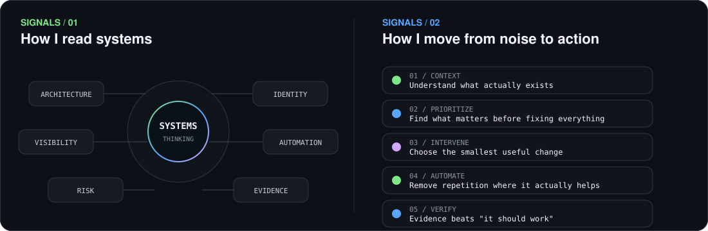
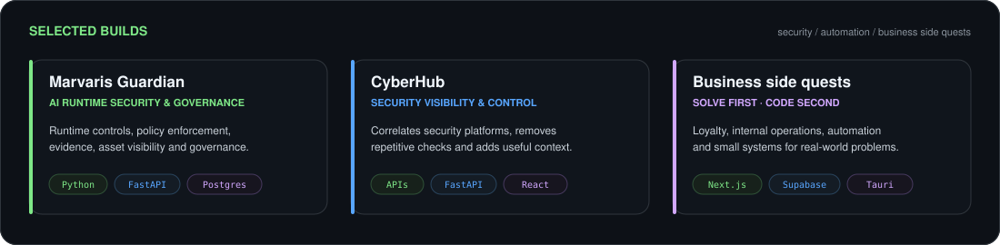
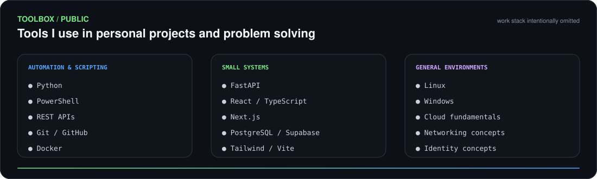
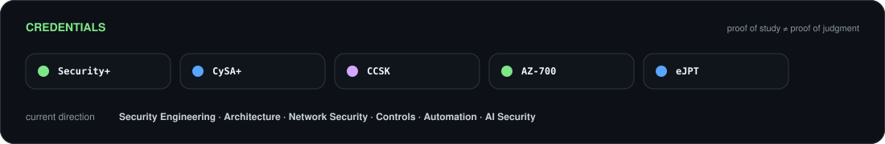

 

 

---

## This is me :)

I'm **Eddy Vargas**, a security professional who likes taking messy systems, finding the signal, and turning uncertainty into decisions that survive contact with reality.

- 🛡️ My work tends to orbit **architecture, network & identity, risk reduction, visibility, automation and problem solving**.
- 🔧 I'm **not a software developer by trade**. I use code, APIs and small systems when they're the shortest useful path to solving a problem.
- 🧠 I explore **AI, applications and emerging technologies** whenever they create an interesting systems problem.
- 🎮 Outside work, I usually end up somewhere around **gaming, technical labs, hardware and random projects**.

> Logs have better memory than meetings.

---

## `signals`

---

## `selected builds`

  

Personal and portfolio projects only. Employer environments, internal tooling and operational details stay off the public profile.

  

Also experimenting with <a href="https://github.com/neavus-23/souls-dev-skill">Souls Dev Skill</a> — evidence-driven technical work with a healthy distrust of implementations that pass on the first try.

---

## `toolbox`

 

Tools are means, not identities. Pick what solves the problem without creating three new ones.

---

## `credentials`

---

## `side quests`

When work isn't consuming the available RAM:

`Gaming` · `Technical labs` · `PC hardware` · `Maker projects` · `Business ideas` · `Technical rabbit holes`

I like learning systems from different angles. Games scratch roughly the same itch: **learn the rules, understand the system, find the edge cases, defeat the boss.**

---

` understand the system · find the signal · make the change · verify the result `

  

github.com/neavus-23

